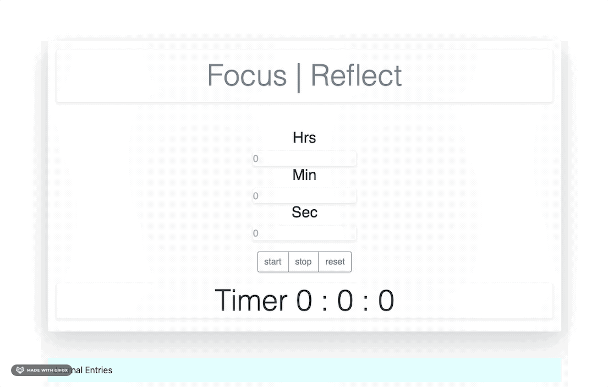
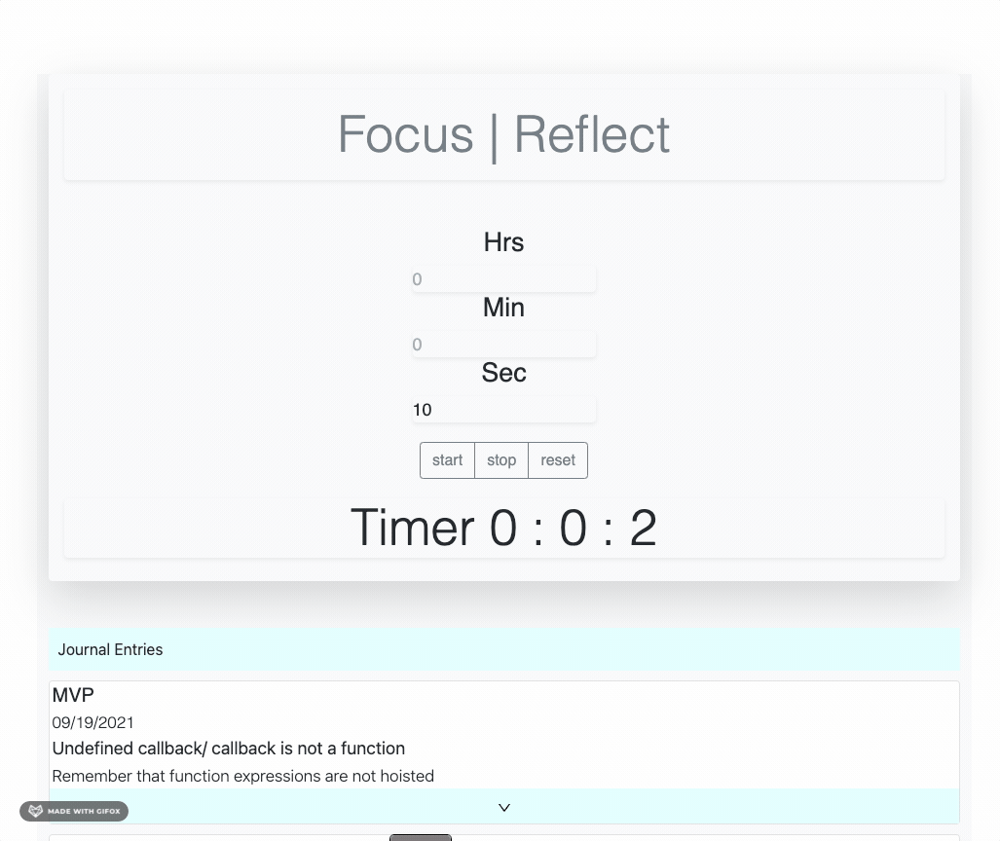

# Focus

Focus is a time-management assistant that prompts you to reflect on and document the progress, issues and blockers that were encountered during the specified time alotted for your task.

* Set the timer and allow Focus to run on an open browser window. 
* When the time has completed, a modal will display and interrupt your current browser window. 
* Document your progress in the modal and submit. 
* Focus saves your entries for retrieval. 


## Building and running on localhost

First install dependencies:

```sh
npm install
```





To create a production build:

```sh
npm run build-prod
```

To create a development build:

```sh
npm run build-dev
```

## Running

Open the file `dist/index.html` in your browser

## Credits

Made with [createapp.dev](https://createapp.dev/)
